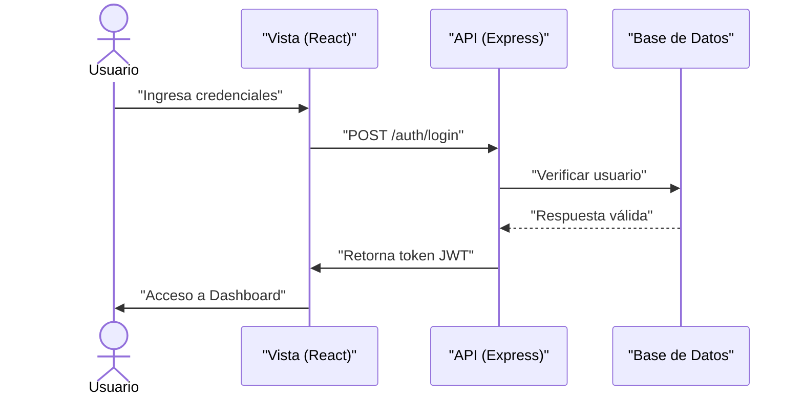
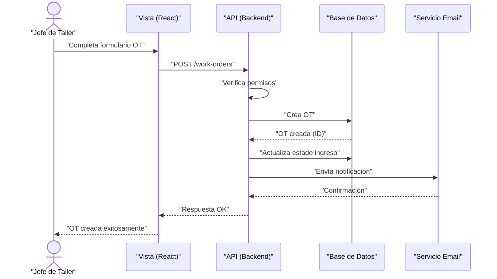
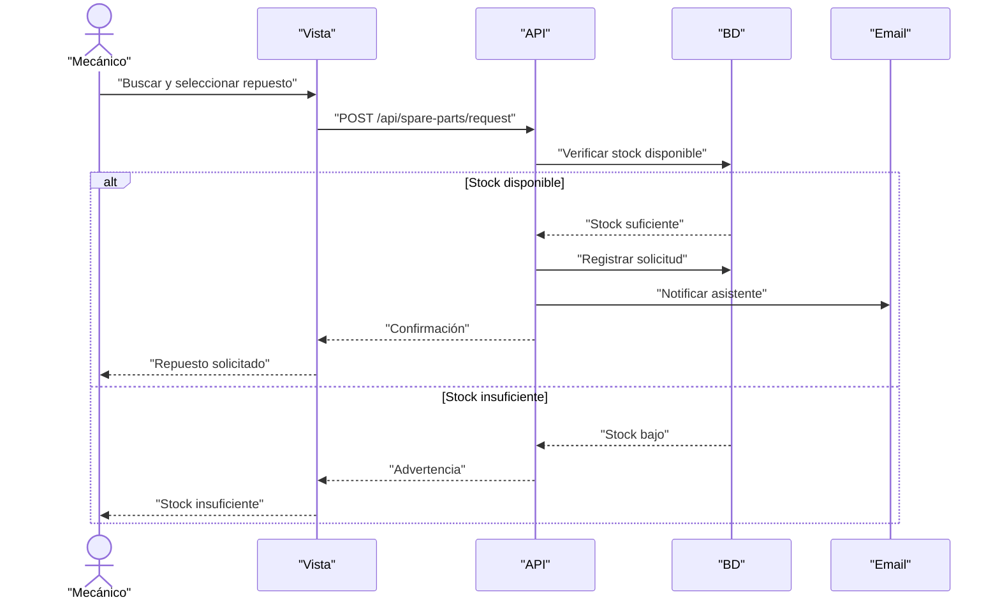
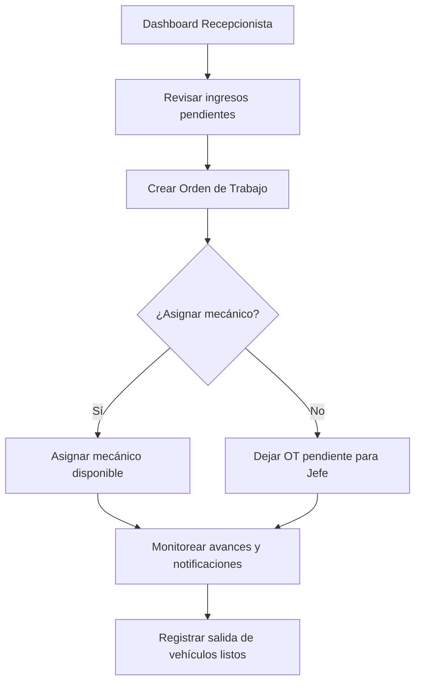
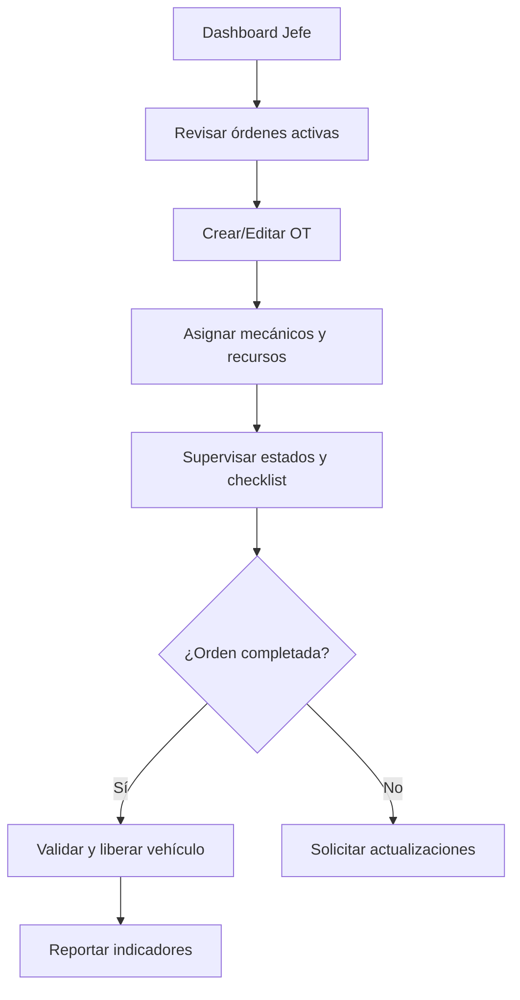
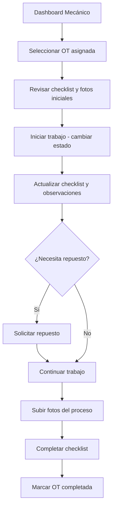
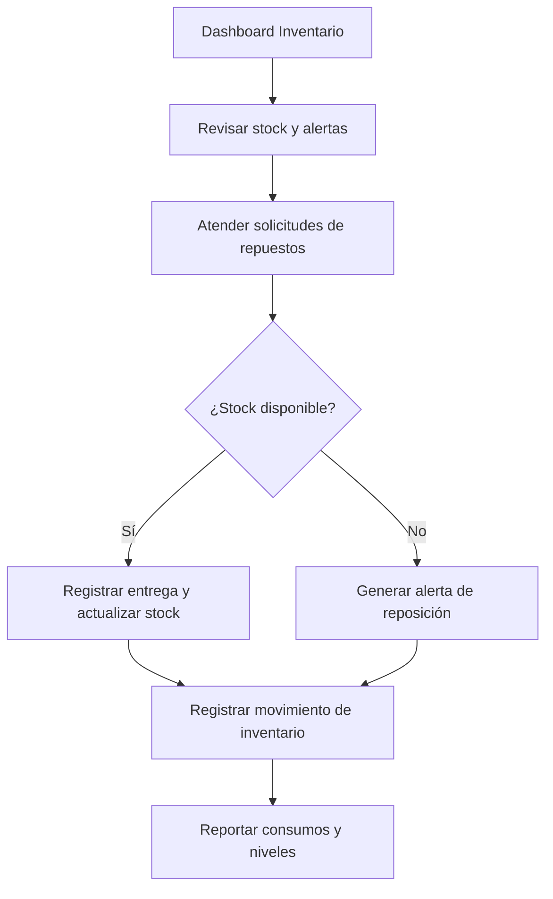
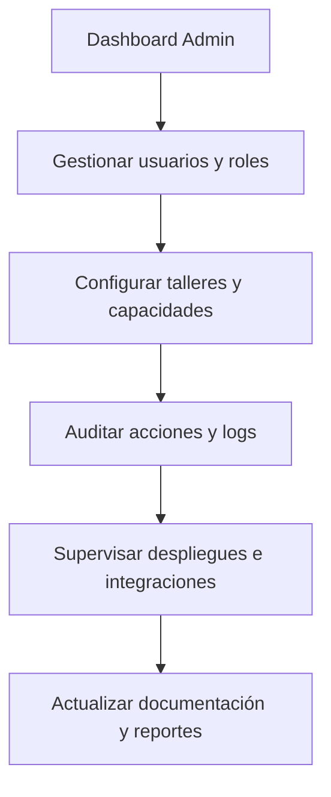

# 🔄 Diagramas de Secuencia - Simplificados

## Sistema de Gestión de Flota PepsiCo Chile

---

## 1. Secuencia: Login de Usuario



---

## 2. Secuencia: Crear Orden de Trabajo



---

## 3. Secuencia: Solicitar Repuesto



---

## 4. Procesos por Rol (Vista General)

> Diagramas de flujo simplificados para explicar qué hace cada actor dentro del sistema.

### Guardia de Portería

```mermaid
flowchart TD
    A[Ingreso al sistema] --> B[Registrar datos del vehículo]
    B --> C[Registrar datos del conductor]
    C --> D{¿Capturar fotos?}
    D -- Sí --> E[Subir/Tomar fotografías]
    D -- No --> F[Revisar resumen]
    E --> F
    F --> G[Confirmar ingreso]
    G --> H[Vehículo queda "En taller"]
```

### Recepcionista de Taller



### Jefe de Taller



### Mecánico



### Encargado de Inventario



### Administrador del Sistema



---

**Exportar a PNG:** https://mermaid.live/
