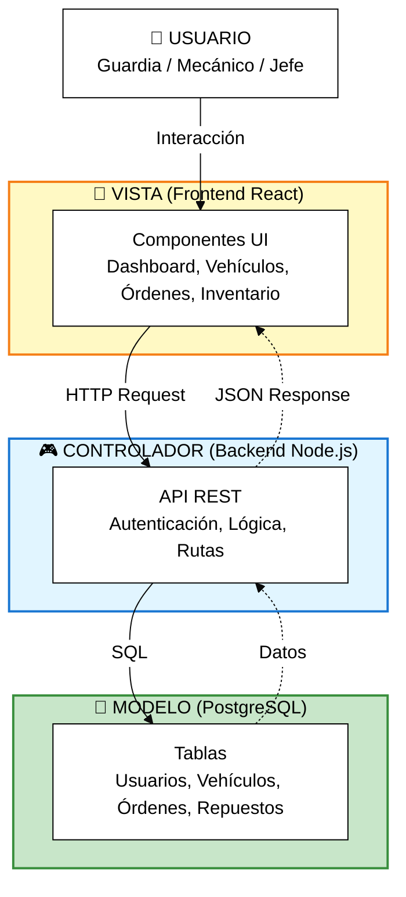
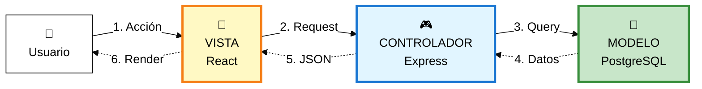

# 🏗️ Arquitectura del Sistema - Patrón MVC

## Sistema de Gestión de Flota PepsiCo Chile

---

## Diagrama MVC Simplificado

---

## Flujo de Datos

---

## Tecnologías

**🎨 Vista (Frontend):**

- React 18 + TypeScript
- Tailwind CSS + shadcn/ui
- Zustand + React Query

**🎮 Controlador (Backend):**

- Node.js 20 + Express.js
- JWT + bcrypt + Zod

**💾 Modelo (Database):**

- PostgreSQL 15+
- Prisma ORM

---

**Exportar a PNG:** https://mermaid.live/
