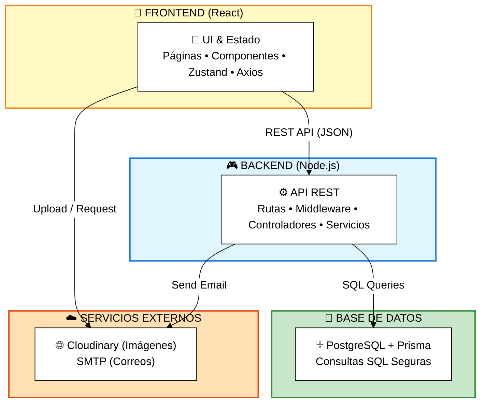

# 🧩 Diagrama de Componentes - Simplificado

## Sistema de Gestión de Flota PepsiCo Chile

---

## Diagrama de Componentes Principal

---

## Componentes por Capa

### 🎨 Frontend (React)

- **Páginas:** Dashboard, Vehículos, Ingresos, OT, Inventario
- **Componentes:** Forms, Tables, Modals, Charts
- **Estado:** Zustand (global), React Query (servidor)
- **Cliente API:** Axios con interceptores

### 🎮 Backend (Node.js)

- **Rutas:** /api/auth, /api/vehicles, /api/entries, /api/work-orders
- **Middleware:** CORS, Helmet, JWT, RBAC, Validación
- **Controllers:** Auth, Vehicle, Entry, WorkOrder, Inventory
- **Services:** Lógica de negocio + Notificaciones

### 💾 Database (PostgreSQL)

- **ORM:** Prisma Client
- **Tablas:** 9 principales (usuarios, vehículos, órdenes, etc.)

---

**Exportar a PNG:** https://mermaid.live/
