# 🚀 Diagrama de Despliegue - Simplificado

## Sistema de Gestión de Flota PepsiCo Chile

---

## Infraestructura Cloud

```mermaid
%%{init: {'theme':'base', 'themeVariables': { 'primaryTextColor':'#000000', 'secondaryTextColor':'#000000', 'tertiaryTextColor':'#000000', 'textColor':'#000000', 'primaryColor':'#ffffff', 'primaryBorderColor':'#000000'}}}%%
graph TB
    U["👥 USUARIOS<br/>Navegadores Web"]
    
    V["☁️ VERCEL<br/>━━━━━━━━<br/>🎨 Frontend React<br/>fleet.pepsico.cl<br/>HTTPS • CDN Global"]
    
    R["☁️ RAILWAY<br/>━━━━━━━━<br/>🎮 Backend Node.js<br/>api.fleet.pepsico.cl<br/>HTTPS • Auto-restart"]
    
    N[("☁️ NEON<br/>━━━━━━━━<br/>💾 PostgreSQL 15+<br/>Base de Datos<br/>SSL • Backups")]
    
    C["☁️ CLOUDINARY<br/>━━━━━━━━<br/>📸 Imágenes<br/>CDN Global<br/>25 GB/mes"]
    
    S["📧 GMAIL<br/>━━━━━━━━<br/>Servicio SMTP<br/>Notificaciones"]
    
    U -->|"HTTPS"| V
    V -->|"REST API<br/>JSON"| R
    R -->|"SQL<br/>Prisma"| N
    V -->|"Upload"| C
    R -->|"Email"| S
    
    style V fill:#FFF9C4,stroke:#F57F17,stroke-width:3px
    style R fill:#E1F5FF,stroke:#1976D2,stroke-width:3px
    style N fill:#C8E6C9,stroke:#388E3C,stroke-width:3px
    style C fill:#FFE0B2,stroke:#E64A19,stroke-width:2px
    style S fill:#FFE0B2,stroke:#E64A19,stroke-width:2px
```

---

## Entornos

```mermaid
%%{init: {'theme':'base', 'themeVariables': { 'primaryTextColor':'#000000', 'secondaryTextColor':'#000000', 'tertiaryTextColor':'#000000', 'textColor':'#000000', 'primaryColor':'#ffffff', 'primaryBorderColor':'#000000'}}}%%
graph LR
    D["💻 DESARROLLO<br/>localhost"]
    S["🧪 STAGING<br/>preview.vercel.app"]
    P["🌟 PRODUCCIÓN<br/>fleet.pepsico.cl"]
    
    D -->|"git push develop"| S
    S -->|"git push main"| P
    
    style D fill:#FFF9C4,stroke:#F57F17
    style S fill:#E1F5FF,stroke:#1976D2
    style P fill:#C8E6C9,stroke:#388E3C
```

---

## Servicios Cloud

| Servicio | Uso | Plan |
|----------|-----|------|
| **Vercel** | Frontend | Free (100 GB/mes) |
| **Railway** | Backend | Free (500 hrs/mes) |
| **Neon** | Database | Free (500 MB) |
| **Cloudinary** | Imágenes | Free (25 GB/mes) |
| **Gmail SMTP** | Emails | Free |

**Costo Total:** $0 USD

---

**Exportar a PNG:** https://mermaid.live/
