# 🔄 Diagramas de Secuencia - Simplificados

## Sistema de Gestión de Flota PepsiCo Chile

---

## 1. Secuencia: Login de Usuario

```mermaid
sequenceDiagram
    actor Usuario
    participant Vista as "Vista (React)"
    participant API as "API (Express)"
    participant BD as "Base de Datos"
  
    Usuario->>Vista: "Ingresa credenciales"
    Vista->>API: "POST /auth/login"
    API->>BD: "Verificar usuario"
    BD-->>API: "Respuesta válida"
    API->>Vista: "Retorna token JWT"
    Vista->>Usuario: "Acceso a Dashboard"
```

---

## 2. Secuencia: Crear Orden de Trabajo

```mermaid
sequenceDiagram
    actor Jefe as "Jefe de Taller"
    participant Vista as "Vista (React)"
    participant API as "API (Backend)"
    participant BD as "Base de Datos"
    participant Email as "Servicio Email"
  
    Jefe->>Vista: "Completa formulario OT"
    Vista->>API: "POST /work-orders"
    API->>API: "Verifica permisos"
    API->>BD: "Crea OT"
    BD-->>API: "OT creada (ID)"
    API->>BD: "Actualiza estado ingreso"
    API->>Email: "Envía notificación"
    Email-->>API: "Confirmación"
    API-->>Vista: "Respuesta OK"
    Vista-->>Jefe: "OT creada exitosamente"
```

---

## 3. Secuencia: Solicitar Repuesto

```mermaid
sequenceDiagram
    actor Mecanico as "Mecánico"
    participant Vista as "Vista"
    participant API as "API"
    participant BD as "BD"
    participant Email as "Email"
  
    Mecanico->>Vista: "Buscar y seleccionar repuesto"
    Vista->>API: "POST /api/spare-parts/request"
    API->>BD: "Verificar stock disponible"
  
    alt Stock disponible
        BD-->>API: "Stock suficiente"
        API->>BD: "Registrar solicitud"
        API->>Email: "Notificar asistente"
        API-->>Vista: "Confirmación"
        Vista-->>Mecanico: "Repuesto solicitado"
    else Stock insuficiente
        BD-->>API: "Stock bajo"
        API-->>Vista: "Advertencia"
        Vista-->>Mecanico: "Stock insuficiente"
    end
```

---

**Exportar a PNG:** https://mermaid.live/
