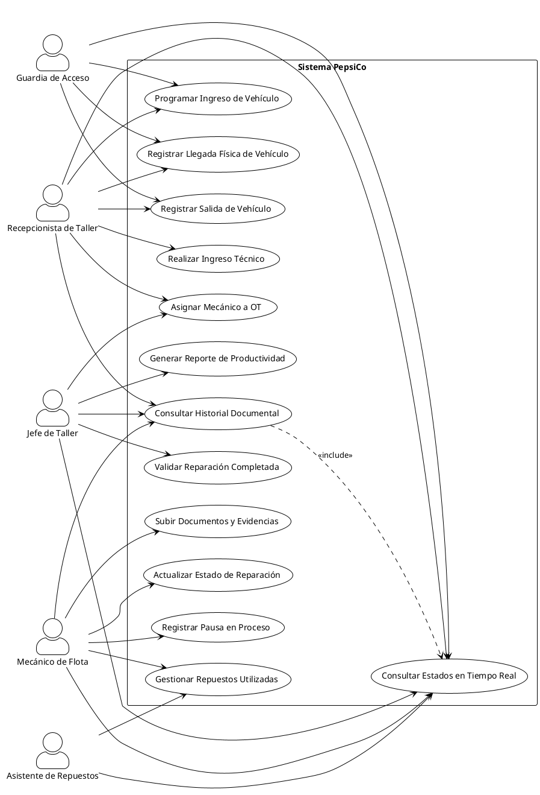

# 📋 Diagrama de Casos de Uso Simplificado

## Sistema de Gestión de Flota PepsiCo Chile

---

## 🎯 Diagrama Principal

### Código PlantUML:



---

## 📊 Descripción del Diagrama

### 🎭 Actores Principales (5)

1. **👮 Guardia de Acceso**

   - Registra entrada y salida de vehículos
   - Toma fotografías del estado inicial
   - Genera códigos de ingreso
2. **📝 Recepcionista de Taller**

   - Valida documentación
   - Crea órdenes de trabajo
   - Coordina el flujo operativo
3. **👨‍💼 Jefe de Taller**

   - Asigna mecánicos a trabajos
   - Supervisa el progreso
   - Genera reportes de productividad
4. **🔧 Mecánico de Flota**

   - Ejecuta las reparaciones
   - Actualiza estados de trabajo
   - Gestiona repuestos utilizados
5. **📦 Asistente de Repuestos**

   - Controla inventario
   - Entrega repuestos
   - Actualiza stock

### 📋 Casos de Uso Principales (13)

#### Flujo de Ingreso:

- **CU1:** Programar Ingreso de Vehículo
- **CU2:** Registrar Llegada Física de Vehículo
- **CU3:** Realizar Ingreso Técnico

#### Flujo de Trabajo:

- **CU4:** Validar Reparación Completada
- **CU5:** Asignar Mecánico a OT
- **CU7:** Actualizar Estado de Reparación
- **CU9:** Registrar Pausa en Proceso

#### Flujo de Repuestos:

- **CU10:** Gestionar Repuestos Utilizadas

#### Flujo de Documentación:

- **CU11:** Subir Documentos y Evidencias
- **CU12:** Consultar Historial Documental

#### Flujo de Salida:

- **CU6:** Registrar Salida de Vehículo

#### Flujo de Reportes:

- **CU8:** Generar Reporte de Productividad
- **CU13:** Consultar Estados en Tiempo Real

---

## 🔄 Flujo Principal del Sistema

```
1️⃣ INGRESO
   Guardia registra llegada → Toma fotos → Genera código

2️⃣ RECEPCIÓN  
   Recepcionista valida → Crea OT → Define prioridad

3️⃣ ASIGNACIÓN
   Jefe asigna mecánico → Programa trabajo

4️⃣ EJECUCIÓN
   Mecánico repara → Actualiza estado → Solicita repuestos

5️⃣ INVENTARIO
   Asistente entrega repuestos → Actualiza stock

6️⃣ FINALIZACIÓN
   Mecánico completa → Jefe valida → Genera reporte

7️⃣ SALIDA
   Guardia registra salida → Verifica documentos
```

---

## 📈 Beneficios del Diagrama Simplificado

✅ **Claridad Visual:** Fácil de entender para stakeholders
✅ **Enfoque Operativo:** Cubre el flujo principal del negocio
✅ **Comunicación:** Ideal para presentaciones y documentación
✅ **Trazabilidad:** Conecta actores con sus responsabilidades principales
✅ **Escalabilidad:** Base para diagramas más detallados

---

## 🔗 Relación con Diagrama Completo

Este diagrama simplificado se relaciona con el diagrama completo de la siguiente manera:

- **Actores:** 5 de 10 actores principales (50%)
- **Casos de Uso:** 13 de 43 casos de uso principales (30%)
- **Cobertura:** 100% del flujo operativo crítico
- **Enfoque:** Flujo principal vs. funcionalidades completas

---

**Fecha:** 14/10/2025
**Versión:** 1.0
**Autor:** Equipo de Desarrollo PepsiCo Fleet Management
**Estado:** ✅ Aprobado
