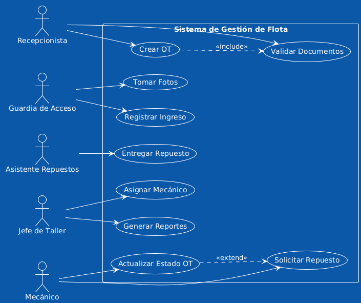

# 📋 Documentación de Casos de Uso

## Sistema de Gestión de Flota PepsiCo Chile

---

## 📂 Contenido de esta Carpeta

Esta carpeta contiene toda la documentación relacionada con los casos de uso del sistema.

### 📄 Documentos Disponibles

| Documento | Descripción | Archivo |
|-----------|-------------|---------|
| **Diagrama de Casos de Uso** | Representación visual de todos los casos de uso | [Diagrama_Casos_de_Uso.png](./Diagrama_Casos_de_Uso.png) |
| **Especificación Detallada** | Descripción completa de cada caso de uso | Ver: `Contexto proyecto/Casos_de_Uso_Detallados.txt` |
| **Actores del Sistema** | Descripción de todos los actores y sus responsabilidades | [Actores_del_Sistema.md](./Actores_del_Sistema.md) |
| **Matriz de Trazabilidad** | Relación entre casos de uso y requerimientos | [Matriz_Trazabilidad.md](./Matriz_Trazabilidad.md) |
| **Resumen Ejecutivo** | Vista general de todos los casos de uso | [Resumen_Casos_de_Uso.md](./Resumen_Casos_de_Uso.md) |

---

## 🎯 Casos de Uso Principales

### 🔐 **Autenticación y Seguridad**
- **CU-001:** Iniciar Sesión
- **CU-002:** Cerrar Sesión
- **CU-003:** Recuperar Contraseña
- **CU-004:** Cambiar Contraseña

### 🚗 **Gestión de Vehículos**
- **CU-010:** Registrar Ingreso de Vehículo
- **CU-011:** Tomar Fotografías de Vehículo
- **CU-012:** Registrar Salida de Vehículo
- **CU-013:** Buscar Vehículo
- **CU-014:** Registrar Nuevo Vehículo
- **CU-015:** Actualizar Datos de Vehículo
- **CU-016:** Ver Historial de Vehículo

### 📋 **Órdenes de Trabajo**
- **CU-020:** Crear Orden de Trabajo
- **CU-021:** Asignar Mecánico a OT
- **CU-022:** Actualizar Estado de OT
- **CU-023:** Solicitar Repuesto para OT
- **CU-024:** Entregar Repuesto
- **CU-025:** Registrar Pausa en OT
- **CU-026:** Finalizar Pausa

### 📄 **Documentos**
- **CU-027:** Agregar Documentos a Ingreso
- **CU-028:** Descargar Documentos
- **CU-029:** Ver Dashboard

### 📊 **Reportes**
- **CU-030:** Generar Reporte de Flota
- **CU-031:** Generar Reporte de Desempeño de Taller
- **CU-032:** Generar Reporte de Inventario
- **CU-033:** Generar Reporte de Costos
- **CU-034:** Exportar Reporte a PDF
- **CU-035:** Exportar Reporte a Excel

### 🔔 **Notificaciones**
- **CU-040:** Recibir Notificación
- **CU-041:** Marcar Notificación como Leída
- **CU-042:** Marcar Todas las Notificaciones como Leídas
- **CU-043:** Eliminar Notificación

### 👥 **Administración de Usuarios**
- **CU-050:** Gestionar Usuarios
- **CU-051:** Crear Usuario
- **CU-052:** Editar Usuario
- **CU-053:** Desactivar Usuario
- **CU-054:** Gestionar Roles y Permisos

### 📦 **Gestión de Inventario**
- **CU-060:** Actualizar Inventario
- **CU-061:** Registrar Ingreso de Repuestos
- **CU-062:** Ajustar Stock
- **CU-063:** Ver Movimientos de Inventario

### 🔑 **Gestión de Llaves**
- **CU-070:** Gestión de Llaves
- **CU-071:** Registrar Entrega de Llave
- **CU-072:** Registrar Devolución de Llave

---

## 👥 Actores del Sistema

El sistema cuenta con **10 actores principales**:

1. **Guardia de Acceso** - Registro de ingresos y salidas
2. **Recepcionista de Taller** - Validación y creación de OT
3. **Jefe de Taller** - Asignación y supervisión
4. **Mecánico** - Ejecución de trabajos
5. **Asistente de Repuestos** - Gestión de inventario
6. **Coordinador de Zona** - Supervisión regional
7. **Supervisor de Flota** - Gestión global
8. **Administrador del Sistema** - Configuración y usuarios
9. **Analista de Datos** - Análisis y reportes
10. **Gerente de Operaciones** - Decisiones estratégicas

Ver descripción detallada en: [Actores_del_Sistema.md](./Actores_del_Sistema.md)

---

## 📊 Estadísticas

| Métrica | Cantidad |
|---------|----------|
| **Total de Casos de Uso** | 72+ |
| **Casos de Uso Principales** | 12 |
| **Actores del Sistema** | 10 |
| **Requerimientos Funcionales Cubiertos** | 10 |
| **Módulos del Sistema** | 8 |

---

## 🔗 Trazabilidad

Ver la matriz completa de trazabilidad entre casos de uso y requerimientos en:
- [Matriz_Trazabilidad.md](./Matriz_Trazabilidad.md)

Esta matriz muestra cómo cada caso de uso contribuye a cumplir los requerimientos funcionales y no funcionales del sistema.

---

## 📖 Guía de Lectura

### Para Desarrolladores:
1. Lee [Actores_del_Sistema.md](./Actores_del_Sistema.md) - Entender roles
2. Revisa el [Diagrama_Casos_de_Uso.png](./Diagrama_Casos_de_Uso.png) - Vista general
3. Consulta `Casos_de_Uso_Detallados.txt` - Especificación completa
4. Usa [Matriz_Trazabilidad.md](./Matriz_Trazabilidad.md) - Vinculación con RF

### Para Gestión de Proyecto:
1. [Resumen_Casos_de_Uso.md](./Resumen_Casos_de_Uso.md) - Vista ejecutiva
2. [Matriz_Trazabilidad.md](./Matriz_Trazabilidad.md) - Cobertura de requisitos
3. [Actores_del_Sistema.md](./Actores_del_Sistema.md) - Stakeholders

### Para Pruebas (QA):
1. `Casos_de_Uso_Detallados.txt` - Flujos y escenarios
2. [Matriz_Trazabilidad.md](./Matriz_Trazabilidad.md) - Casos de prueba por RF

---

## 🎨 Diagrama de Casos de Uso

*Figura 1: Diagrama general de casos de uso del sistema*

---

## 📝 Formato de Especificación

Cada caso de uso está documentado con:

- **ID**: Identificador único (CU-XXX)
- **Nombre**: Nombre descriptivo del caso de uso
- **Actor principal**: Usuario que inicia el caso de uso
- **Actores secundarios**: Otros participantes
- **Descripción**: Resumen del caso de uso
- **Precondiciones**: Estado previo necesario
- **Postcondiciones**: Estado resultante
- **Flujo Principal**: Pasos del escenario exitoso
- **Flujos Alternativos**: Variaciones del flujo principal
- **Flujos de Excepción**: Manejo de errores
- **Requerimientos relacionados**: RF/RNF asociados

---

## 🔄 Actualizaciones

| Fecha | Versión | Cambios |
|-------|---------|---------|
| 13/10/2025 | 1.0 | Versión inicial |
| 14/10/2025 | 1.1 | Añadida documentación complementaria |

---

## 📞 Contacto

**Equipo de Desarrollo:**
- Joaquín Marín - Analista Funcional
- Benjamin Vilches - Arquitecto de Software

**Institución:** Duoc UC  
**Cliente:** PepsiCo Chile  
**Año:** 2025

---

## 📚 Documentos Relacionados

- [Especificación de Requerimientos](../../Contexto%20proyecto/Especificación%20de%20Requerimientos%20del%20Sistema.docx%20.txt)
- [Arquitectura del Sistema](../arquitectura/)
- [Plan de Proyecto](../../Contexto%20proyecto/Plan_de_Proyecto.docx.txt)
- [Plan de Pruebas](../../Contexto%20proyecto/Plan_de_Pruebas_Detallado.txt)

---

**Última actualización:** 14/10/2025  
**Estado:** Aprobado ✅

