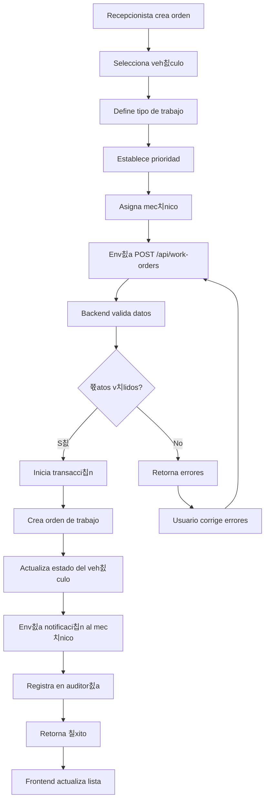
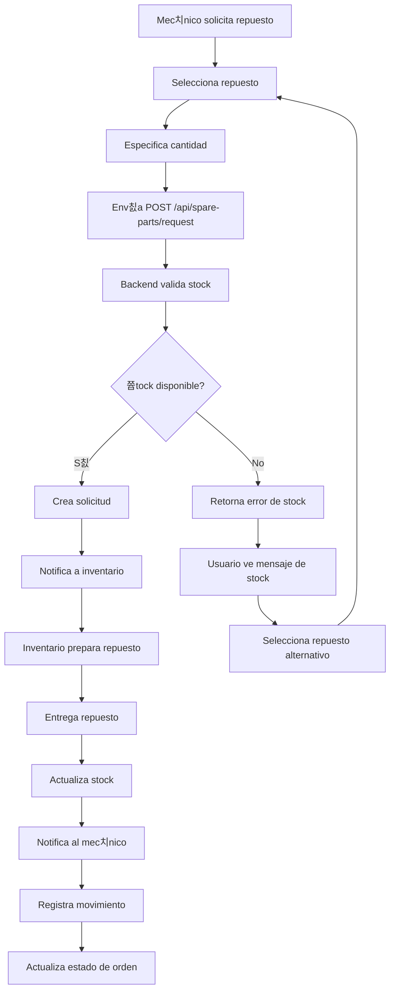
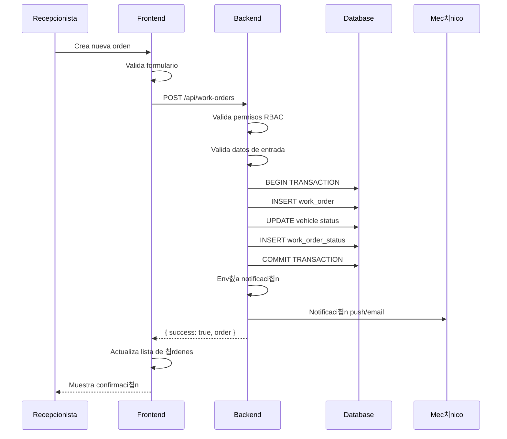
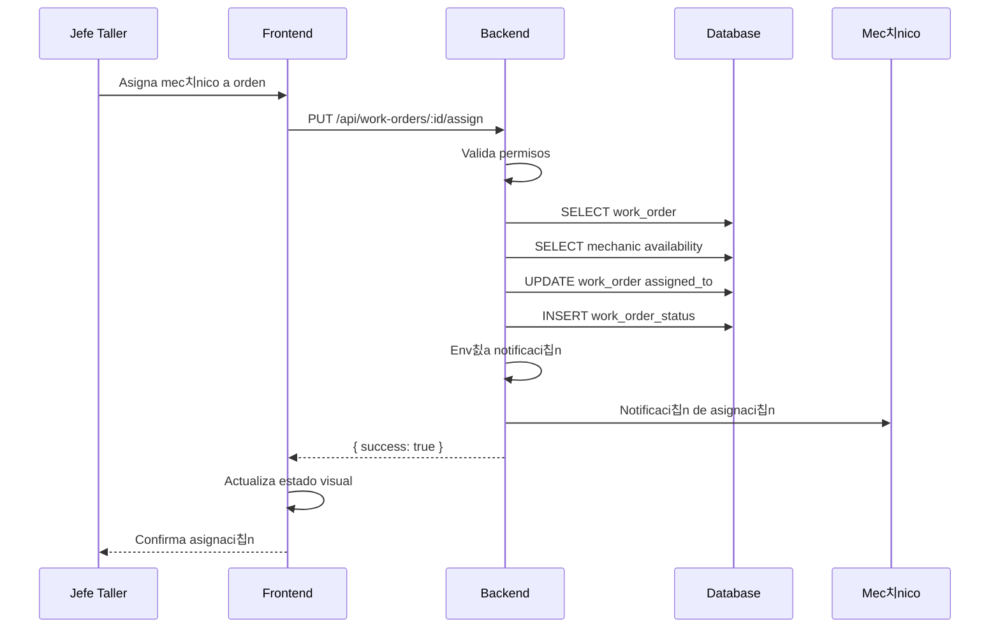
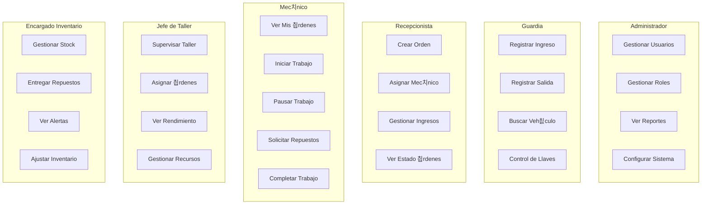
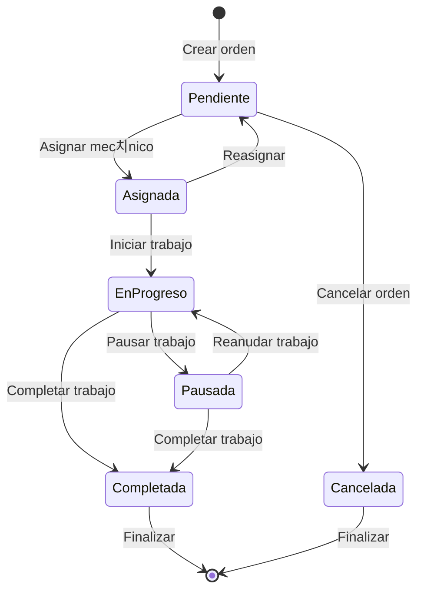

# 📊 Diagramas UML Técnicos - PepsiCo Fleet Management

**Proyecto:** PepsiCo Fleet Management System  
**Versión:** 1.0.0  
**Fecha:** Octubre 15, 2024  
**Equipo:** Joaquín Marín & Benjamin Vilches  

---

## 📋 Índice

1. [Diagrama de Clases](#diagrama-de-clases)
2. [Diagrama de Base de Datos](#diagrama-de-base-de-datos)
3. [Diagrama de Flujo de Información](#diagrama-de-flujo-de-información)
4. [Diagrama de Secuencia](#diagrama-de-secuencia)
5. [Diagrama de Componentes](#diagrama-de-componentes)
6. [Diagrama de Despliegue](#diagrama-de-despliegue)

---

## 1. Diagrama de Clases

### 1.1 Clases del Backend

```mermaid
classDiagram
    class User {
        +String id
        +String rut
        +String firstName
        +String lastName
        +String email
        +String password
        +String phone
        +String roleId
        +String workshopId
        +Boolean isActive
        +DateTime lastLogin
        +DateTime createdAt
        +DateTime updatedAt
        +login()
        +logout()
        +updateProfile()
    }

    class Role {
        +String id
        +String name
        +String description
        +DateTime createdAt
        +DateTime updatedAt
        +addPermission()
        +removePermission()
    }

    class Permission {
        +String id
        +String resource
        +String action
        +String description
        +DateTime createdAt
    }

    class Vehicle {
        +String id
        +String licensePlate
        +String vehicleType
        +String brand
        +String model
        +Int year
        +String vin
        +String fleetNumber
        +String regionId
        +String status
        +Boolean isActive
        +DateTime createdAt
        +DateTime updatedAt
        +create()
        +update()
        +delete()
    }

    class VehicleEntry {
        +String id
        +String entryCode
        +String vehicleId
        +String workshopId
        +String driverRut
        +String driverName
        +String driverPhone
        +DateTime entryDate
        +DateTime exitDate
        +Int entryKm
        +Int exitKm
        +String fuelLevel
        +Boolean hasKeys
        +String observations
        +JSON photos
        +String status
        +String createdById
        +DateTime createdAt
        +DateTime updatedAt
        +create()
        +update()
        +exit()
    }

    class WorkOrder {
        +String id
        +String orderNumber
        +String vehicleId
        +String entryId
        +String workshopId
        +String workType
        +String priority
        +String description
        +Float estimatedHours
        +String assignedToId
        +String currentStatus
        +DateTime startedAt
        +DateTime completedAt
        +Float totalHours
        +String observations
        +String createdById
        +DateTime createdAt
        +DateTime updatedAt
        +create()
        +update()
        +assign()
        +start()
        +complete()
    }

    class SparePart {
        +String id
        +String code
        +String name
        +String description
        +String category
        +String unitOfMeasure
        +Float unitPrice
        +Int currentStock
        +Int minStock
        +Int maxStock
        +String location
        +Boolean isActive
        +DateTime createdAt
        +DateTime updatedAt
        +adjustStock()
        +request()
        +deliver()
    }

    class Workshop {
        +String id
        +String code
        +String name
        +String regionId
        +String address
        +String city
        +String phone
        +Int capacity
        +Boolean isActive
        +DateTime createdAt
        +DateTime updatedAt
        +getStats()
        +getSchedule()
    }

    class Region {
        +String id
        +String code
        +String name
        +Boolean isActive
        +DateTime createdAt
    }

    class AuditLog {
        +String id
        +String userId
        +String action
        +String resource
        +String resourceId
        +JSON details
        +String ipAddress
        +String userAgent
        +DateTime createdAt
        +log()
    }

    class Notification {
        +String id
        +String userId
        +String title
        +String message
        +String type
        +String relatedTo
        +String relatedId
        +Boolean isRead
        +DateTime readAt
        +DateTime createdAt
        +send()
        +markAsRead()
    }

    %% Relaciones
    User ||--o{ VehicleEntry : creates
    User ||--o{ WorkOrder : creates
    User ||--o{ WorkOrder : assigned
    User ||--o{ AuditLog : generates
    User ||--o{ Notification : receives
    User }o--|| Role : has
    User }o--o| Workshop : belongs

    Role ||--o{ Permission : has

    Vehicle ||--o{ VehicleEntry : has
    Vehicle ||--o{ WorkOrder : has
    Vehicle }o--|| Region : belongs

    VehicleEntry ||--o{ WorkOrder : generates
    VehicleEntry ||--|| KeyControl : has

    WorkOrder ||--o{ WorkOrderStatus : has
    WorkOrder ||--o{ WorkOrderPhoto : has
    WorkOrder ||--o{ WorkPause : has
    WorkOrder ||--o{ WorkOrderSparePart : has

    SparePart ||--o{ WorkOrderSparePart : used
    SparePart ||--o{ SparePartMovement : has

    Workshop ||--o{ User : contains
    Workshop ||--o{ VehicleEntry : receives
    Workshop ||--o{ WorkOrder : processes
    Workshop ||--o{ WorkshopSchedule : has
    Workshop }o--|| Region : belongs

    Region ||--o{ Workshop : contains
    Region ||--o{ Vehicle : contains
```

### 1.2 Clases del Frontend

```mermaid
classDiagram
    class AuthStore {
        +User user
        +Boolean isAuthenticated
        +Boolean isLoading
        +String error
        +login(email, password)
        +logout()
        +getCurrentUser()
        +refreshToken()
    }

    class ApiService {
        +String baseURL
        +Object headers
        +get(url, params)
        +post(url, data)
        +put(url, data)
        +delete(url)
        +setAuthToken(token)
        +handleResponse(response)
        +handleError(error)
    }

    class AuthService {
        +login(credentials)
        +logout()
        +refreshToken()
        +getCurrentUser()
        +changePassword(data)
    }

    class VehicleService {
        +getAll(params)
        +getById(id)
        +create(data)
        +update(id, data)
        +delete(id)
        +getStats()
    }

    class WorkOrderService {
        +getAll(params)
        +getById(id)
        +create(data)
        +update(id, data)
        +assign(id, mechanicId)
        +start(id)
        +complete(id)
        +pause(id, reason)
        +resume(id)
    }

    class DashboardService {
        +getStats(period)
        +getActivity()
        +getMechanicsPerformance()
    }

    class MainLayout {
        +User user
        +Array navigation
        +Boolean sidebarOpen
        +toggleSidebar()
        +logout()
        +render()
    }

    class AdminDashboard {
        +Object stats
        +Array recentActivity
        +Array urgentOrders
        +Array lowStock
        +loadData()
        +render()
    }

    class GuardiaDashboard {
        +Array activeEntries
        +Array recentEntries
        +createEntry()
        +registerExit()
        +searchVehicle()
        +render()
    }

    class RecepcionistaDashboard {
        +Array pendingEntries
        +Array availableMechanics
        +createWorkOrder()
        +assignMechanic()
        +render()
    }

    class MecanicoDashboard {
        +Array myOrders
        +Array pendingOrders
        +startWork()
        +pauseWork()
        +completeWork()
        +requestSparePart()
        +render()
    }

    class JefeTallerDashboard {
        +Object workshopStats
        +Array allOrders
        +Array mechanics
        +Array alerts
        +assignOrder()
        +superviseWork()
        +render()
    }

    class InventarioDashboard {
        +Array lowStock
        +Array requests
        +Array movements
        +deliverSparePart()
        +adjustStock()
        +render()
    }

    %% Relaciones
    AuthStore ||--|| ApiService : uses
    ApiService ||--|| AuthService : provides
    ApiService ||--|| VehicleService : provides
    ApiService ||--|| WorkOrderService : provides
    ApiService ||--|| DashboardService : provides

    MainLayout ||--|| AuthStore : uses
    MainLayout ||--o{ AdminDashboard : renders
    MainLayout ||--o{ GuardiaDashboard : renders
    MainLayout ||--o{ RecepcionistaDashboard : renders
    MainLayout ||--o{ MecanicoDashboard : renders
    MainLayout ||--o{ JefeTallerDashboard : renders
    MainLayout ||--o{ InventarioDashboard : renders

    AdminDashboard ||--|| DashboardService : uses
    GuardiaDashboard ||--|| VehicleService : uses
    RecepcionistaDashboard ||--|| WorkOrderService : uses
    MecanicoDashboard ||--|| WorkOrderService : uses
    JefeTallerDashboard ||--|| DashboardService : uses
    InventarioDashboard ||--|| VehicleService : uses
```

---

## 2. Diagrama de Base de Datos

### 2.1 Modelo Entidad-Relación


### 2.2 Índices de Base de Datos

```sql
-- Índices para performance
CREATE INDEX idx_users_email ON users(email);
CREATE INDEX idx_users_rut ON users(rut);
CREATE INDEX idx_users_role_id ON users(role_id);
CREATE INDEX idx_users_workshop_id ON users(workshop_id);

CREATE INDEX idx_vehicles_license_plate ON vehicles(license_plate);
CREATE INDEX idx_vehicles_region_id ON vehicles(region_id);
CREATE INDEX idx_vehicles_status ON vehicles(status);

CREATE INDEX idx_entries_vehicle_id ON vehicle_entries(vehicle_id);
CREATE INDEX idx_entries_workshop_id ON vehicle_entries(workshop_id);
CREATE INDEX idx_entries_entry_date ON vehicle_entries(entry_date);
CREATE INDEX idx_entries_status ON vehicle_entries(status);

CREATE INDEX idx_work_orders_vehicle_id ON work_orders(vehicle_id);
CREATE INDEX idx_work_orders_entry_id ON work_orders(entry_id);
CREATE INDEX idx_work_orders_workshop_id ON work_orders(workshop_id);
CREATE INDEX idx_work_orders_assigned_to_id ON work_orders(assigned_to_id);
CREATE INDEX idx_work_orders_current_status ON work_orders(current_status);
CREATE INDEX idx_work_orders_created_at ON work_orders(created_at);

CREATE INDEX idx_spare_parts_code ON spare_parts(code);
CREATE INDEX idx_spare_parts_category ON spare_parts(category);

CREATE INDEX idx_notifications_user_read ON notifications(user_id, is_read);
CREATE INDEX idx_notifications_created_at ON notifications(created_at);

CREATE INDEX idx_audit_user_id ON audit_logs(user_id);
CREATE INDEX idx_audit_resource ON audit_logs(resource, resource_id);
CREATE INDEX idx_audit_created_at ON audit_logs(created_at);
```

---

## 3. Diagrama de Flujo de Información

### 3.1 Flujo de Autenticación


### 3.2 Flujo de Creación de Ingreso


### 3.3 Flujo de Asignación de Orden



### 3.4 Flujo de Gestión de Inventario



---

## 4. Diagrama de Secuencia

### 4.1 Secuencia de Login


### 4.2 Secuencia de Creación de Orden



### 4.3 Secuencia de Asignación de Mecánico



---

## 5. Diagrama de Componentes

### 5.1 Arquitectura de Componentes


### 5.2 Componentes del Frontend


---

## 6. Diagrama de Despliegue

### 6.1 Arquitectura de Despliegue


### 6.2 Configuración de Ambientes


---

## 7. Diagramas de Casos de Uso

### 7.1 Casos de Uso por Rol



### 7.2 Flujo de Casos de Uso


---

## 8. Diagramas de Estado

### 8.1 Estados de Órdenes de Trabajo



### 8.2 Estados de Vehículos


---

## 9. Diagramas de Red

### 9.1 Topología de Red


### 9.2 Flujo de Datos en Red


---

## 10. Diagramas de Performance

### 10.1 Métricas de Performance

```mermaid
graph TB
    subgraph "Frontend Metrics"
        A[First Contentful Paint < 1s]
        B[Largest Contentful Paint < 2s]
        C[Cumulative Layout Shift < 0.1]
        D[First Input Delay < 100ms]
    end
    
    subgraph "Backend Metrics"
        E[Response Time < 200ms]
        F[Throughput > 1000 req/s]
        G[Error Rate < 1%]
        H[Uptime > 99.5%]
    end
    
    subgraph "Database Metrics"
        I[Query Time < 50ms]
        J[Connection Pool > 20]
        K[Index Usage > 95%]
        L[Cache Hit Rate > 80%]
    end
```

### 10.2 Optimizaciones Implementadas

```mermaid
graph TB
    subgraph "Frontend Optimizations"
        A[Code Splitting]
        B[Lazy Loading]
        C[Image Optimization]
        D[Bundle Compression]
    end
    
    subgraph "Backend Optimizations"
        E[Database Indexing]
        F[Query Optimization]
        G[Response Caching]
        H[Connection Pooling]
    end
    
    subgraph "Database Optimizations"
        I[Index Strategy]
        J[Query Analysis]
        K[Partitioning]
        L[Replication]
    end
```

---

**Última actualización:** Octubre 15, 2024  
**Versión:** 1.0.0  
**Mantenido por:** Joaquín Marín & Benjamin Vilches
